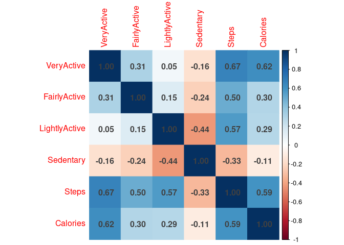
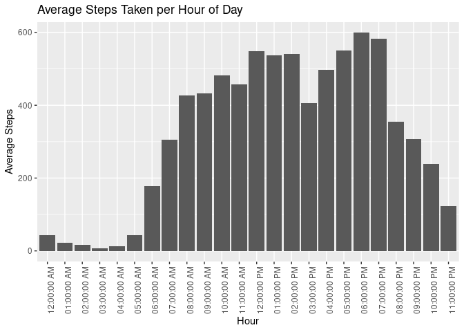
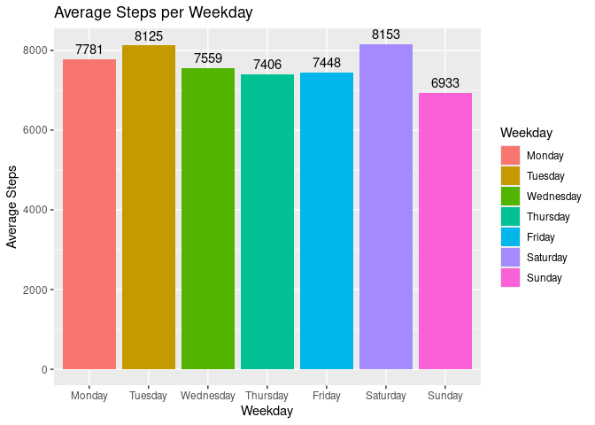
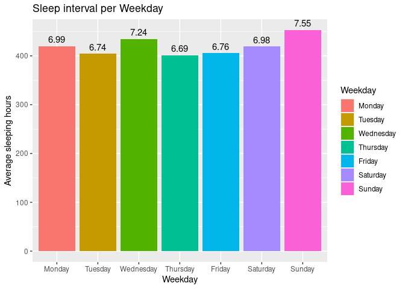
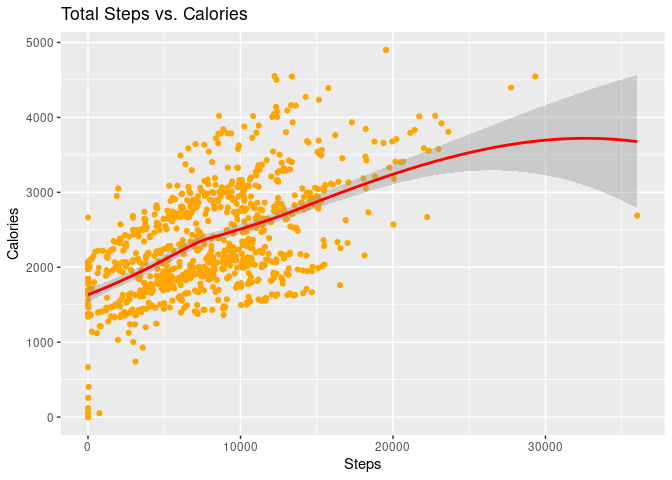
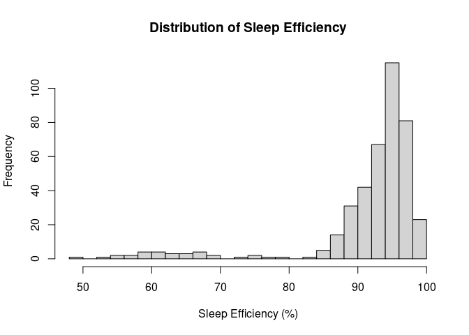
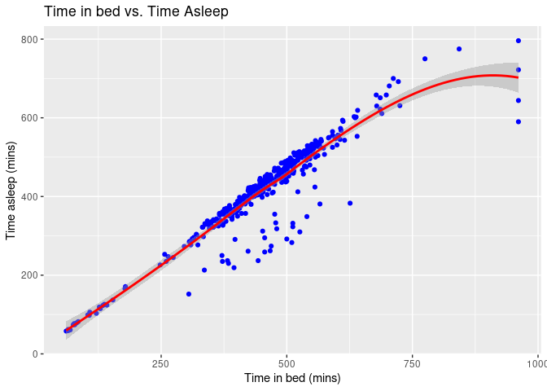
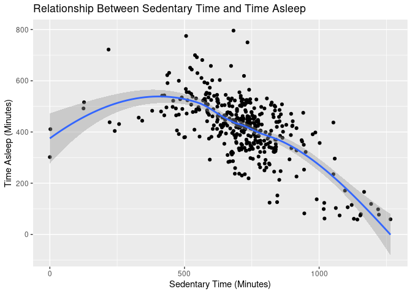

Smart device fitness data analysis unlocking new growth opportunities.
================
Created by: David Huynh

- [Context](#context)
- [Ask](#ask)
  - [1. Identify the business task](#1-identify-the-business-task)
  - [2. Consider key stakeholders](#2-consider-key-stakeholders)
  - [3. Clarify the business
    statement](#3-clarify-the-business-statement)
- [Prepare](#prepare)
- [Process](#process)
- [Analyze](#analyze)
- [Share](#share)
- [Act](#act)

# Context

Bellabeat, founded in 2013 by Urška Sršen and Sando Mur, is a
tech-driven wellness company that creates health-focused smart products
designed for women, empowering them with insights into their well-being.

By 2016, the company had expanded globally, launched multiple products,
and increased its availability through online retailers and its
e-commerce website. Bellabeat utilizes both traditional and digital
marketing, investing in Google Search, social media (Facebook,
Instagram, Twitter), YouTube video ads, and Google Display Network
campaigns.

The marketing analytics team has been tasked with providing insights
that can inform Bellabeat’s future marketing strategy and growth
opportunities. This analysis follows the data analytics framework,
including 6 steps: [Ask](#ask), [Prepare](#prepare),
[Process](#process), [Analyze](#analyze), [Share](#share), and
[Act](#act).

# Ask

### 1. Identify the business task

The marketing analytics team was asked to focus on one Bellabeat’s
product and analyze smart device usage data in order to gain insight
into how people are already using their smart devices and present
high-level recommendations for how these trends can inform Bellabeat
marketing strategy.

### 2. Consider key stakeholders

Key stakeholders include: Urška Sršen: Bellabeat’s cofounder and Chief
Creative Officer Sando Mur: Mathematician and Bellabeat’s cofounder
Bellabeat marketing analytics team Consumers who are using smart devices
from Bellabeat Potential customers who are going to buy Bellabeat’s
products

### 3. Clarify the business statement

Analyzing smart device fitness data could help unlock new growth
opportunities for the company by discovering underlying patterns, trends
and potential connection. The scope of this analysis focus on only one
aspect of the dataset. It is expected that the recommendations could
shed light on the improvements in individual’s general health by using
smart devices from Bellabeat.

# Prepare

The Fitbit Fitness Tracker Data is made available online through
Mobius’s repository on Kaggle. This analysis only uses the data from
12th April, 2016 to 12th May, 2016.

The data is organized as a set of tables with specific tracker data such
as physical activity, heat rate, and sleep monitoring in long format.
The first columns of all tables are users’ ID.

The data is quite ROCCC because it is comprehensive and managed by a
reliable platform. However, there could be several issues in terms of
bias and credibility. Only a small number of records may not reflect the
overall themes while the data was registered in 2016 which could be
different from current contexts when the presence of smart devices are
increasing rapidly. Moreover, as a third-party data source, careful
considerations should be taken under specific circumstances.

The dataset contains personal fitness records from about 30 users who
consented to the submission of personal tracker data for the purpose of
explore users’ habits. The author also published the dataset in his
public domain without licensing requirement so that everyone can easily
get access and perform further data mining and exploration.

There are 18 datasets containing periodical records in different
intervals. However, this analysis only look further into daily activity
and sleeping records, as well as weigh-logging data.

``` r
# install.packages("tidyverse")
# install.packages("skimr")
# install.packages("janitor")
# install.packages("ggplot2")
# install.packages("dplyr")
# install.packages("corrplot")
library(tidyverse)
```

    ## ── Attaching core tidyverse packages ──────────────────────── tidyverse 2.0.0 ──
    ## ✔ dplyr     1.1.4     ✔ readr     2.1.5
    ## ✔ forcats   1.0.0     ✔ stringr   1.5.1
    ## ✔ ggplot2   3.5.1     ✔ tibble    3.2.1
    ## ✔ lubridate 1.9.3     ✔ tidyr     1.3.1
    ## ✔ purrr     1.0.2     
    ## ── Conflicts ────────────────────────────────────────── tidyverse_conflicts() ──
    ## ✖ dplyr::filter() masks stats::filter()
    ## ✖ dplyr::lag()    masks stats::lag()
    ## ℹ Use the conflicted package (<http://conflicted.r-lib.org/>) to force all conflicts to become errors

``` r
library(skimr)
library(janitor)
```

    ## 
    ## Attaching package: 'janitor'
    ## 
    ## The following objects are masked from 'package:stats':
    ## 
    ##     chisq.test, fisher.test

``` r
library(ggplot2)
library(dplyr)
library(corrplot)
```

    ## corrplot 0.95 loaded

``` r
## Load CSV files ##
setwd("/cloud/project/database/FitabaseData2")
daily_activity <- read.csv("dailyActivity_merged.csv")
sleep_day <- read.csv("sleepDay_merged.csv")
weight_log <- read.csv("weightLogInfo_merged.csv")
hourly_steps <- read.csv("hourlySteps_merged.csv")
hourly_calories <- read.csv("hourlyCalories_merged.csv")
```

# Process

In this step, we will check the data for error with appropriate tools.
After that, transforming the data is preferred to let us work with it
effectively. Now, let’s explore key data tables.

**Table**: daily_activity

``` r
head(daily_activity)
```

    ##           Id ActivityDate TotalSteps TotalDistance TrackerDistance
    ## 1 1503960366    4/12/2016      13162          8.50            8.50
    ## 2 1503960366    4/13/2016      10735          6.97            6.97
    ## 3 1503960366    4/14/2016      10460          6.74            6.74
    ## 4 1503960366    4/15/2016       9762          6.28            6.28
    ## 5 1503960366    4/16/2016      12669          8.16            8.16
    ## 6 1503960366    4/17/2016       9705          6.48            6.48
    ##   LoggedActivitiesDistance VeryActiveDistance ModeratelyActiveDistance
    ## 1                        0               1.88                     0.55
    ## 2                        0               1.57                     0.69
    ## 3                        0               2.44                     0.40
    ## 4                        0               2.14                     1.26
    ## 5                        0               2.71                     0.41
    ## 6                        0               3.19                     0.78
    ##   LightActiveDistance SedentaryActiveDistance VeryActiveMinutes
    ## 1                6.06                       0                25
    ## 2                4.71                       0                21
    ## 3                3.91                       0                30
    ## 4                2.83                       0                29
    ## 5                5.04                       0                36
    ## 6                2.51                       0                38
    ##   FairlyActiveMinutes LightlyActiveMinutes SedentaryMinutes Calories
    ## 1                  13                  328              728     1985
    ## 2                  19                  217              776     1797
    ## 3                  11                  181             1218     1776
    ## 4                  34                  209              726     1745
    ## 5                  10                  221              773     1863
    ## 6                  20                  164              539     1728

``` r
skim_without_charts(daily_activity)
```

|                                                  |                |
|:-------------------------------------------------|:---------------|
| Name                                             | daily_activity |
| Number of rows                                   | 940            |
| Number of columns                                | 15             |
| \_\_\_\_\_\_\_\_\_\_\_\_\_\_\_\_\_\_\_\_\_\_\_   |                |
| Column type frequency:                           |                |
| character                                        | 1              |
| numeric                                          | 14             |
| \_\_\_\_\_\_\_\_\_\_\_\_\_\_\_\_\_\_\_\_\_\_\_\_ |                |
| Group variables                                  | None           |

Data summary

**Variable type: character**

| skim_variable | n_missing | complete_rate | min | max | empty | n_unique | whitespace |
|:--------------|----------:|--------------:|----:|----:|------:|---------:|-----------:|
| ActivityDate  |         0 |             1 |   8 |   9 |     0 |       31 |          0 |

**Variable type: numeric**

| skim_variable            | n_missing | complete_rate |         mean |           sd |         p0 |          p25 |          p50 |          p75 |         p100 |
|:-------------------------|----------:|--------------:|-------------:|-------------:|-----------:|-------------:|-------------:|-------------:|-------------:|
| Id                       |         0 |             1 | 4.855407e+09 | 2.424805e+09 | 1503960366 | 2.320127e+09 | 4.445115e+09 | 6.962181e+09 | 8.877689e+09 |
| TotalSteps               |         0 |             1 | 7.637910e+03 | 5.087150e+03 |          0 | 3.789750e+03 | 7.405500e+03 | 1.072700e+04 | 3.601900e+04 |
| TotalDistance            |         0 |             1 | 5.490000e+00 | 3.920000e+00 |          0 | 2.620000e+00 | 5.240000e+00 | 7.710000e+00 | 2.803000e+01 |
| TrackerDistance          |         0 |             1 | 5.480000e+00 | 3.910000e+00 |          0 | 2.620000e+00 | 5.240000e+00 | 7.710000e+00 | 2.803000e+01 |
| LoggedActivitiesDistance |         0 |             1 | 1.100000e-01 | 6.200000e-01 |          0 | 0.000000e+00 | 0.000000e+00 | 0.000000e+00 | 4.940000e+00 |
| VeryActiveDistance       |         0 |             1 | 1.500000e+00 | 2.660000e+00 |          0 | 0.000000e+00 | 2.100000e-01 | 2.050000e+00 | 2.192000e+01 |
| ModeratelyActiveDistance |         0 |             1 | 5.700000e-01 | 8.800000e-01 |          0 | 0.000000e+00 | 2.400000e-01 | 8.000000e-01 | 6.480000e+00 |
| LightActiveDistance      |         0 |             1 | 3.340000e+00 | 2.040000e+00 |          0 | 1.950000e+00 | 3.360000e+00 | 4.780000e+00 | 1.071000e+01 |
| SedentaryActiveDistance  |         0 |             1 | 0.000000e+00 | 1.000000e-02 |          0 | 0.000000e+00 | 0.000000e+00 | 0.000000e+00 | 1.100000e-01 |
| VeryActiveMinutes        |         0 |             1 | 2.116000e+01 | 3.284000e+01 |          0 | 0.000000e+00 | 4.000000e+00 | 3.200000e+01 | 2.100000e+02 |
| FairlyActiveMinutes      |         0 |             1 | 1.356000e+01 | 1.999000e+01 |          0 | 0.000000e+00 | 6.000000e+00 | 1.900000e+01 | 1.430000e+02 |
| LightlyActiveMinutes     |         0 |             1 | 1.928100e+02 | 1.091700e+02 |          0 | 1.270000e+02 | 1.990000e+02 | 2.640000e+02 | 5.180000e+02 |
| SedentaryMinutes         |         0 |             1 | 9.912100e+02 | 3.012700e+02 |          0 | 7.297500e+02 | 1.057500e+03 | 1.229500e+03 | 1.440000e+03 |
| Calories                 |         0 |             1 | 2.303610e+03 | 7.181700e+02 |          0 | 1.828500e+03 | 2.134000e+03 | 2.793250e+03 | 4.900000e+03 |

``` r
#As the distances are not of interest, we will remove them from the original table The format of Id and ActivityDate should be corrected as nominal and date instead of numeric and character
activity_df <- daily_activity %>% 
               select(Id,ActivityDate,TotalSteps,VeryActiveMinutes,
                          FairlyActiveMinutes,LightlyActiveMinutes,
                          SedentaryMinutes,Calories)%>%
                rename(Date = ActivityDate, Steps = TotalSteps,
                       VeryActive = VeryActiveMinutes,
                       FairlyActive = FairlyActiveMinutes,
                       LightlyActive = LightlyActiveMinutes,
                       Sedentary = SedentaryMinutes)
activity_df$Id <- as.character(activity_df$Id)
activity_df$Date <- format(as.Date(activity_df$Date, format="%m/%d/%Y"), "%m/%d/%Y")
```

**Table**: sleep_day

``` r
head(sleep_day)
```

    ##           Id              SleepDay TotalSleepRecords TotalMinutesAsleep
    ## 1 1503960366 4/12/2016 12:00:00 AM                 1                327
    ## 2 1503960366 4/13/2016 12:00:00 AM                 2                384
    ## 3 1503960366 4/15/2016 12:00:00 AM                 1                412
    ## 4 1503960366 4/16/2016 12:00:00 AM                 2                340
    ## 5 1503960366 4/17/2016 12:00:00 AM                 1                700
    ## 6 1503960366 4/19/2016 12:00:00 AM                 1                304
    ##   TotalTimeInBed
    ## 1            346
    ## 2            407
    ## 3            442
    ## 4            367
    ## 5            712
    ## 6            320

``` r
skim_without_charts(sleep_day)
```

|                                                  |           |
|:-------------------------------------------------|:----------|
| Name                                             | sleep_day |
| Number of rows                                   | 413       |
| Number of columns                                | 5         |
| \_\_\_\_\_\_\_\_\_\_\_\_\_\_\_\_\_\_\_\_\_\_\_   |           |
| Column type frequency:                           |           |
| character                                        | 1         |
| numeric                                          | 4         |
| \_\_\_\_\_\_\_\_\_\_\_\_\_\_\_\_\_\_\_\_\_\_\_\_ |           |
| Group variables                                  | None      |

Data summary

**Variable type: character**

| skim_variable | n_missing | complete_rate | min | max | empty | n_unique | whitespace |
|:--------------|----------:|--------------:|----:|----:|------:|---------:|-----------:|
| SleepDay      |         0 |             1 |  20 |  21 |     0 |       31 |          0 |

**Variable type: numeric**

| skim_variable      | n_missing | complete_rate |         mean |          sd |         p0 |        p25 |        p50 |        p75 |       p100 |
|:-------------------|----------:|--------------:|-------------:|------------:|-----------:|-----------:|-----------:|-----------:|-----------:|
| Id                 |         0 |             1 | 5.000979e+09 | 2.06036e+09 | 1503960366 | 3977333714 | 4702921684 | 6962181067 | 8792009665 |
| TotalSleepRecords  |         0 |             1 | 1.120000e+00 | 3.50000e-01 |          1 |          1 |          1 |          1 |          3 |
| TotalMinutesAsleep |         0 |             1 | 4.194700e+02 | 1.18340e+02 |         58 |        361 |        433 |        490 |        796 |
| TotalTimeInBed     |         0 |             1 | 4.586400e+02 | 1.27100e+02 |         61 |        403 |        463 |        526 |        961 |

``` r
#As the TotalSleepRecords is redundant, we will ignore it.
#Again, the format of Id and ActivityDate should be corrected as nominal and date instead of numeric and character. These concept will also be applied for other tables. Moreover, the recorded time remains unchanged, making it less interesting to be kept.
sleep_df <- sleep_day %>% 
            select(-TotalSleepRecords)%>%
            rename(Date = SleepDay)
sleep_df$Id <- as.character(sleep_df$Id)
sleep_df$Date <- format(as.Date(sleep_df$Date, format="%m/%d/%Y %I:%M:%S %p"), format="%m/%d/%Y")
```

**Table**: hourly_steps

``` r
head(hourly_steps)
```

    ##           Id          ActivityHour StepTotal
    ## 1 1503960366 4/12/2016 12:00:00 AM       373
    ## 2 1503960366  4/12/2016 1:00:00 AM       160
    ## 3 1503960366  4/12/2016 2:00:00 AM       151
    ## 4 1503960366  4/12/2016 3:00:00 AM         0
    ## 5 1503960366  4/12/2016 4:00:00 AM         0
    ## 6 1503960366  4/12/2016 5:00:00 AM         0

``` r
# We can apply the same process for the hourly steps and calories data, but the recorded hours matter. Therefore, we separated the date and hour in order to join or summarise data.
hourly_steps$ActivityHour <- as.POSIXct(hourly_steps$ActivityHour, format="%m/%d/%Y %I:%M:%S %p")
steps_df <- hourly_steps %>% 
          mutate(hourly_steps, Date = format(ActivityHour, "%m/%d/%Y"),
                  Hour = format(ActivityHour, "%I:%M:%S %p")) %>%
          select(-ActivityHour )
steps_df$Id <- as.character(steps_df$Id)
```

**Table**: hourly_calories

``` r
head(hourly_calories)
```

    ##           Id          ActivityHour Calories
    ## 1 1503960366 4/12/2016 12:00:00 AM       81
    ## 2 1503960366  4/12/2016 1:00:00 AM       61
    ## 3 1503960366  4/12/2016 2:00:00 AM       59
    ## 4 1503960366  4/12/2016 3:00:00 AM       47
    ## 5 1503960366  4/12/2016 4:00:00 AM       48
    ## 6 1503960366  4/12/2016 5:00:00 AM       48

``` r
hourly_calories$ActivityHour <- as.POSIXct(hourly_calories$ActivityHour, format="%m/%d/%Y %I:%M:%S %p")
calo_df <- hourly_calories %>% 
  mutate(hourly_calories, Date = format(ActivityHour, "%m/%d/%Y"),
         Hour = format(ActivityHour, "%I:%M:%S %p")) %>%
  select(-ActivityHour )
calo_df$Id <- as.character(calo_df$Id)
```

**Table**: weight_log

``` r
head(weight_log)
```

    ##           Id                  Date WeightKg WeightPounds Fat   BMI
    ## 1 1503960366  5/2/2016 11:59:59 PM     52.6     115.9631  22 22.65
    ## 2 1503960366  5/3/2016 11:59:59 PM     52.6     115.9631  NA 22.65
    ## 3 1927972279  4/13/2016 1:08:52 AM    133.5     294.3171  NA 47.54
    ## 4 2873212765 4/21/2016 11:59:59 PM     56.7     125.0021  NA 21.45
    ## 5 2873212765 5/12/2016 11:59:59 PM     57.3     126.3249  NA 21.69
    ## 6 4319703577 4/17/2016 11:59:59 PM     72.4     159.6147  25 27.45
    ##   IsManualReport        LogId
    ## 1           True 1.462234e+12
    ## 2           True 1.462320e+12
    ## 3          False 1.460510e+12
    ## 4           True 1.461283e+12
    ## 5           True 1.463098e+12
    ## 6           True 1.460938e+12

``` r
#For the weight data, the measurements in Pounds are not informative as we already have the weights in Kg.
#It is also significant that the majority of Fat indicators is NA while the LogId 
#is not quite useful.
weight_df <- weight_log %>% 
  select(Id, Date, WeightKg, IsManualReport, BMI)
weight_df$Id <- as.character(weight_df$Id)
weight_df$Date <- as.POSIXct(weight_df$Date , format="%m/%d/%Y %I:%M:%S %p")
```

Additionally, we may check missing values in each dataset.

``` r
colSums(is.na(activity_df))
```

    ##            Id          Date         Steps    VeryActive  FairlyActive 
    ##             0             0             0             0             0 
    ## LightlyActive     Sedentary      Calories 
    ##             0             0             0

``` r
colSums(is.na(sleep_df))
```

    ##                 Id               Date TotalMinutesAsleep     TotalTimeInBed 
    ##                  0                  0                  0                  0

``` r
colSums(is.na(weight_df))
```

    ##             Id           Date       WeightKg IsManualReport            BMI 
    ##              0              0              0              0              0

``` r
colSums(is.na(steps_df))
```

    ##        Id StepTotal      Date      Hour 
    ##         0         0         0         0

``` r
colSums(is.na(calo_df))
```

    ##       Id Calories     Date     Hour 
    ##        0        0        0        0

Finally, we want to remove duplicates if any

``` r
activity_df <- activity_df %>% distinct()
sleep_df <- sleep_df %>% distinct()
weight_df <- weight_df %>% distinct()
steps_df <- steps_df %>% distinct()
calo_df <- calo_df %>% distinct()
```

# Analyze

Once the data is nicely prepared and processed, we can dive in the
analyzing step. In this step, firstly, let’s find out the summary
statistics in each dataset.

``` r
# activity data.
n_distinct(activity_df$Id)
```

    ## [1] 33

``` r
nrow(activity_df)
```

    ## [1] 940

``` r
activity_df %>%
  select(Steps, VeryActive, FairlyActive, LightlyActive, Sedentary, Calories)%>%
  summary()
```

    ##      Steps         VeryActive      FairlyActive    LightlyActive  
    ##  Min.   :    0   Min.   :  0.00   Min.   :  0.00   Min.   :  0.0  
    ##  1st Qu.: 3790   1st Qu.:  0.00   1st Qu.:  0.00   1st Qu.:127.0  
    ##  Median : 7406   Median :  4.00   Median :  6.00   Median :199.0  
    ##  Mean   : 7638   Mean   : 21.16   Mean   : 13.56   Mean   :192.8  
    ##  3rd Qu.:10727   3rd Qu.: 32.00   3rd Qu.: 19.00   3rd Qu.:264.0  
    ##  Max.   :36019   Max.   :210.00   Max.   :143.00   Max.   :518.0  
    ##    Sedentary         Calories   
    ##  Min.   :   0.0   Min.   :   0  
    ##  1st Qu.: 729.8   1st Qu.:1828  
    ##  Median :1057.5   Median :2134  
    ##  Mean   : 991.2   Mean   :2304  
    ##  3rd Qu.:1229.5   3rd Qu.:2793  
    ##  Max.   :1440.0   Max.   :4900

``` r
# sleep_day data.
n_distinct(sleep_df$Id)
```

    ## [1] 24

``` r
nrow(sleep_df)
```

    ## [1] 410

``` r
sleep_df %>%
  select(TotalMinutesAsleep , TotalTimeInBed)%>%
  summary()
```

    ##  TotalMinutesAsleep TotalTimeInBed 
    ##  Min.   : 58.0      Min.   : 61.0  
    ##  1st Qu.:361.0      1st Qu.:403.8  
    ##  Median :432.5      Median :463.0  
    ##  Mean   :419.2      Mean   :458.5  
    ##  3rd Qu.:490.0      3rd Qu.:526.0  
    ##  Max.   :796.0      Max.   :961.0

``` r
# weight_log data.
n_distinct(weight_df$Id)
```

    ## [1] 8

``` r
nrow(weight_df)
```

    ## [1] 67

``` r
weight_df %>%
  select(WeightKg, BMI)%>%
  summary()
```

    ##     WeightKg           BMI       
    ##  Min.   : 52.60   Min.   :21.45  
    ##  1st Qu.: 61.40   1st Qu.:23.96  
    ##  Median : 62.50   Median :24.39  
    ##  Mean   : 72.04   Mean   :25.19  
    ##  3rd Qu.: 85.05   3rd Qu.:25.56  
    ##  Max.   :133.50   Max.   :47.54

``` r
# steps data
n_distinct(steps_df$Id)
```

    ## [1] 33

``` r
nrow(steps_df)
```

    ## [1] 22099

``` r
steps_df %>%
  select(StepTotal) %>%
  summary()
```

    ##    StepTotal      
    ##  Min.   :    0.0  
    ##  1st Qu.:    0.0  
    ##  Median :   40.0  
    ##  Mean   :  320.2  
    ##  3rd Qu.:  357.0  
    ##  Max.   :10554.0

``` r
# calories data
n_distinct(calo_df$Id)
```

    ## [1] 33

``` r
nrow(calo_df)
```

    ## [1] 22099

``` r
calo_df %>%
  select(Calories) %>%
  summary()
```

    ##     Calories     
    ##  Min.   : 42.00  
    ##  1st Qu.: 63.00  
    ##  Median : 83.00  
    ##  Mean   : 97.39  
    ##  3rd Qu.:108.00  
    ##  Max.   :948.00

Initial findings:

1.  jkhjkl

2.  223

3.  ewds

After identifying key findings from the initial analysis, we can delve
deeper into patterns and potential concerns related to user behavior.
This further analysis will focus on trends in activity levels, sleep
effectiveness, highlighting any significant insights.

``` r
# 0. The relationship between active time, steps vs calories?
# Select the relevant columns
active_level <- activity_df %>%
  select(VeryActive, FairlyActive, LightlyActive, Sedentary, Steps, Calories)
  
# Calculate correlation matrix and plot
cor_matrix <- cor(active_level)
corrplot(cor_matrix, method = 'color',addCoef.col = 'grey25')
```

<!-- -->

# Share

# Act

################################################ 

``` r
## Explore key tables ##


# 1. What is the average daily step count? Are users meeting the 10,000-step recommendation?
#   Refer to previous summary
# 2. How many hours do users sleep on average?
#   Refer to previous summary

# 3. Active levels during the day and in a week:
# 3.1 What time of day are users most active?
steps_by_hour <- steps_df %>%
  group_by(Hour) %>%
  summarize(mean_steps = mean(StepTotal, na.rm = TRUE)) %>%
  mutate(NumericHour = as.numeric(format(as.POSIXct(Hour, format="%I:%M:%S %p"), "%H")))%>%
  arrange(NumericHour)

ggplot(data = steps_by_hour) +
  geom_col(mapping=aes(y = mean_steps, x = reorder(Hour, NumericHour))) +
  theme(axis.text.x = element_text(angle = 90)) +
  labs(title = "Average Steps Taken per Hour of Day",
       x = "Hour", y = "Average Steps")
```

<!-- -->

``` r
# 3.2 Are users more active on weekdays vs. weekends?
activity_df <- mutate(activity_df, Weekday = weekdays(as.Date(activity_df$Date, format="%m/%d/%Y")))
activity_df$Weekday <- factor(activity_df$Weekday , levels = c("Monday", "Tuesday", "Wednesday", 
                                                               "Thursday", "Friday", "Saturday", "Sunday"))
weekly_steps <- activity_df %>%
  group_by(Weekday) %>%
  summarise(AverageSteps = mean(Steps, na.rm = TRUE))

ggplot(weekly_steps, aes(x = Weekday, y = AverageSteps, fill = Weekday)) +
  geom_bar(stat = "identity") +
  geom_text(aes(label = round(AverageSteps, 0)), vjust = -0.5) +
  labs(title = "Average Steps per Weekday",
       x = "Weekday",
       y = "Average Steps") 
```

<!-- -->

``` r
# 3.3 Do users sleep more on weekends vs. weekdays?
sleep_df <- mutate(sleep_df, Weekday = weekdays(as.Date(sleep_df$Date, format="%m/%d/%Y")))
sleep_df$Weekday <- factor(sleep_df$Weekday , levels = c("Monday", "Tuesday", "Wednesday", 
                                                               "Thursday", "Friday", "Saturday", "Sunday"))
weekly_sleep <- sleep_df %>%
  group_by(Weekday) %>%
  summarise(AverageSleep = mean(TotalMinutesAsleep, na.rm = TRUE))

ggplot(weekly_sleep, aes(x = Weekday, y = AverageSleep, fill = Weekday)) +
  geom_bar(stat = "identity") +
  geom_text(aes(label = round(AverageSleep/60, 2)), vjust = -0.5) +
  labs(title = "Sleep interval per Weekday",
       x = "Weekday",
       y = "Average sleeping hours")
```

<!-- -->

``` r
# 4. Relationship:
# 4.1 Are users with higher activity levels burning significantly more calories?
ggplot(data = activity_df, mapping = aes(x=Steps, y=Calories)) + 
  geom_point(color = "orange") + geom_smooth(color = "red") +
  labs(title = "Total Steps vs. Calories")
```

    ## `geom_smooth()` using method = 'loess' and formula = 'y ~ x'

<!-- -->

``` r
# 4.2 Do people fall asleep easily when in bed?
sleep_df <- sleep_df %>%
  mutate(sleep_eff = round(TotalMinutesAsleep / TotalTimeInBed * 100, 1))

hist(sleep_df$sleep_eff, breaks = 20,
     main = "Distribution of Sleep Efficiency", 
     xlab = "Sleep Efficiency (%)")
```

<!-- -->

``` r
ggplot(data = sleep_df, mapping = aes(x=TotalTimeInBed, y=TotalMinutesAsleep)) + 
  geom_point(color = "blue") + geom_smooth(color = "red") +
  labs(title = "Time in bed vs. Time Asleep",
       x = 'Time in bed (mins)',
       y = 'Time asleep (mins)')
```

    ## `geom_smooth()` using method = 'loess' and formula = 'y ~ x'

<!-- -->

``` r
# 4.3 Do people who are more sedentary sleep better?
# Merging these two datasets together ##
combined_data <- merge(activity_df, sleep_df, by = c("Id", "Date"), all = FALSE)
n_distinct(combined_data$Id)
```

    ## [1] 24

``` r
ggplot(combined_data, aes(x = Sedentary, y = TotalMinutesAsleep)) +
  geom_point() +
  geom_smooth() +
  labs(
    title = "Relationship Between Sedentary Time and Time Asleep",
    x = "Sedentary Time (Minutes)",
    y = "Time Asleep (Minutes)"
  )
```

    ## `geom_smooth()` using method = 'loess' and formula = 'y ~ x'

<!-- -->
